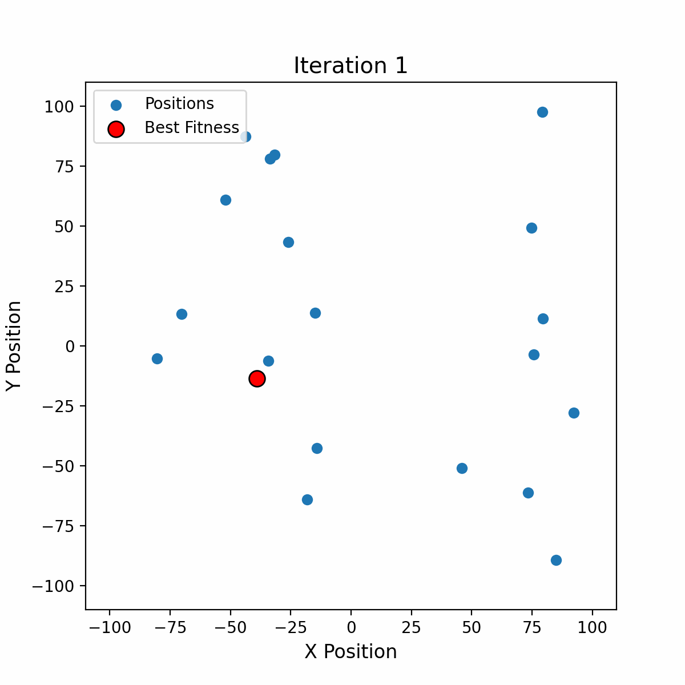

# PEPO

A parallel implementation in C with OpenMP and MPI of the Emperor Penguin Optimization (EPO) algorithm.

## Project Structure

```
.
├── images             // Contains images for the README
├── lib
│   ├── agent.c
│   ├── agent.h        // Contains the agent struct representing it as a fitness and a position
│   ├── cli.c
│   ├── cli.h          // Handles CLI parsing
│   ├── csv.c
│   ├── csv.h          // Handles CSV logging
│   ├── epo.c
│   ├── epo.h          // Contains a dedicated struct and optimization algorithm
│   ├── f_functions.c
│   ├── f_functions.h  // Contains the fitness benchmark functions
│   ├── space.c
│   ├── space.h        // Struct that represents the space (list of agents and bounds)
│   ├── utils.c
│   └── utils.h        // Random number generation, utility functions, etc.
├── main.c
├── Makefile
└── README.md
```

## Algorithm Behavior

### Emperor Penguin Optimization (EPO) Algorithm

EPO is a bio-inspired metaheuristic optimization algorithm that simulates the huddling behavior of emperor penguins in Antarctica to survive extreme cold. The algorithm consists of several key phases:

1. **Huddle Formation** - Penguins group together to conserve heat, representing the initial population of candidate solutions.
2. **Temperature Calculation** - A temperature profile is assigned to each penguin based on its position, influencing movement.
3. **Distance Computation** - The relative distances between penguins are used to balance exploration and exploitation.
4. **Effective Mover Selection** - The best solution is identified, and other penguins adjust their positions accordingly.

The algorithm mathematically models these behaviors to optimize complex engineering problems efficiently.

### Social Force

The social force is calculated as follows:

$$
S(x) = \Bigl(\sqrt{f\cdot e^{-l\cdot x} - e^{-x}}\Bigr)^2
$$

Where:

- $x$ is the current iteration number.
- $f$ is the exploration parameter.
- $l$ is the exploitation parameter.

> Square rooting the expression and squaring it again makes no sense to us, but that's what the authors of the algorithm did.

This is the coverage of the $S$ function with variation in $f$ and $l$ parameters:


The parameters affect the initial value of the social force and the rate of decrease:

- $f$ affects the initial value of the social force.
- $l$ affects the rate of decrease of the social force.

### Algorithm Execution

The behavior of the algorithm over iterations:



## Compilation and Execution

### Makefile Rules

The project includes a `Makefile` with the following rules:

- **`make run`**: Compiles and runs the program with the specified number of processes and threads.
  ```sh
  make run NPROCS=4 NTHREADS=1 ARGS="-p 500 -v 2 -i 100"
  ```
- **`make clean`**: Cleans the build directory.

### Command-line Arguments

The executable supports various command-line arguments:

```
./epo.out -h
Usage: ./epo.out [-p N] [-v N] [-i N] [-lb N] [-ub N] [-f N] [-l N] [-R N] [-M N] [-s N]
Options:
	-p,   --penguins       Number of penguins (default: 80)
	-v,   --variables      Number of variables (default: 3)
	-i,   --iterations     Number of iterations (default: 100)
	-lb,  --lower_bound    Lower bound of search space (default: -100.000000)
	-ub,  --upper_bound    Upper bound of search space (default: 100.000000)
	-f                     Exploration control parameter (default: 2.000000)
	-l                     Exploitation control parameter (default: 1.500000)
	-R,   --radius         Huddle radius (default: 0.500000)
	-M                     Movement parameter (default: 2.000000)
	-s,   --scale          Scale factor (default: 1.000000)
	-ff,  --fitness        Fitness function (default: sphere) [sphere, matyas, bukin, mccormick, michealewicz]
	-h,   --help           Display this help message
```

### Parallel Execution

PEPO leverages **MPI** and **OpenMP** for parallel execution. Example run with multiple processes and threads:

```sh
mpirun -np 4 ./epo.out -p 500 -v 2 -i 100
```

or with OpenMP threading:

```sh
export OMP_NUM_THREADS=4
mpirun -np 2 ./epo.out -p 500 -v 2 -i 100
```

## References

### Papers

- Dhiman, G., & Kumar, V. (2018). Emperor penguin optimizer: A bio-inspired algorithm for engineering problems. In *Knowledge-Based Systems* (Vol. 159, pp. 20–50). [DOI](https://doi.org/10.1016/j.knosys.2018.06.001)
- Serag, A. E. S., Zaher, H., Ragaa, N., & Sayed, H. (2024). Improving the Emperor Penguin Optimizer Algorithm through Adapted Weighted Sum Mutation Strategy with Information Vector. In *Informatica* (Vol. 48, Issue 10). Slovenian Association Informatika. [DOI](https://doi.org/10.31449/inf.v48i10.5757)
- Khalid, O. W., Isa, N. A. M., & Sakim, H. A. M. (2023). Emperor penguin optimizer: A comprehensive review based on state-of-the-art meta-heuristic algorithms. In *Alexandria Engineering Journal* (Vol. 63, pp. 487–526). Elsevier BV.

### Code

- [EPOWIV](https://github.com/ahmedsssssA/EPOWIV) - Emperor Penguin Optimizer Algorithm through Adapted Weighted Sum Mutation Strategy with Information Vector
- [Opytimizer](https://github.com/gugarosa/opytimizer) - A Python library consisting of meta-heuristic optimization algorithms.


