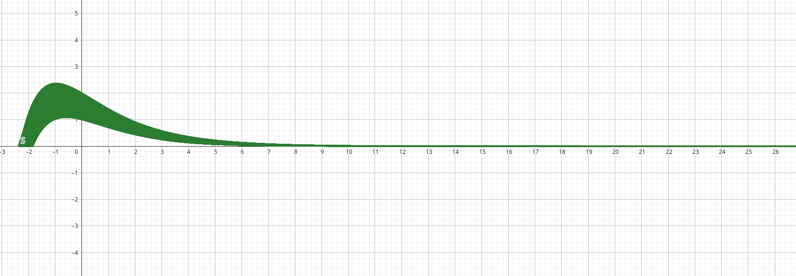

# PEPO

A parallel implementation in C with OpenMP and MPI of the Emperor Penguin Optimization algorithm (EPO). 

## Parameters investigation

### Social force

The social force is calculated as follows:

$$
S(x) = \Bigl(\sqrt{f\cdot e^{-l\cdot x} - e^{-x}}\Bigr)^2
$$

Where:

- $x$ is the current iteration number.
- $f$ is the exploration parameter.
- $l$ is the exploitation parameter.

> Square rooting the expression and squaring it again makes no sense to us but that's what the authors of the algorithm did.

This is coverage of the $S$ function with the variation of $f$ and $l$ parameters.

So the parameters affect the initial value of the social force and the rate of decrease.

Specifically:

- $f$ affects the initial value of the social force.
- $l$ affects the rate of decrease of the social force.

## References

### Papers

- Dhiman, G., & Kumar, V. (2018). Emperor penguin optimizer: A bio-inspired algorithm for engineering problems. In Knowledge-Based Systems (Vol. 159, pp. 20–50). https://doi.org/10.1016/j.knosys.2018.06.001

- Serag, A. E. S., Zaher, H., Ragaa, N., & Sayed, H. (2024). Improving the Emperor Penguin Optimizer Algorithm through Adapted Weighted Sum Mutation Strategy with Information Vector. In Informatica (Vol. 48, Issue 10). Slovenian Association Informatika. https://doi.org/10.31449/inf.v48i10.5757

- Khalid, O. W., Isa, N. A. M., & Sakim, H. A. M. (2023). Emperor penguin optimizer: A comprehensive review based on state-of-the-art meta-heuristic algorithms. In Alexandria Engineering Journal (Vol. 63, pp. 487–526). Elsevier BV.

### Code

- [EPOWIV](https://github.com/ahmedsssssA/EPOWIV) Emperor Penguin Optimizer Algorithm through Adapted Weighted Sum Mutation Strategy with Information Vector
- [Opytimizer](https://github.com/gugarosa/opytimizer) a Python library consisting of meta-heuristic optimization algorithms.